# MediaPipe_for_OBS
An Electron App to send MediaPipe data to OBS. Landmark positions from the MediaPipe pose model are sent to an OBS Text Soure.   
The Text Source can be read by the Advanced Scene Switcher or a Browser Source.  


## OBS Setup
MediaPipe for OBS app needs 
1. the OBS Web Socket Server,
2. an OBS Video source with a projector window
3. A Browser of Advanced Scene Switcher to receive the landmark data


### Turn on OBS WebSocket Server
- In OBS menu bar, click Tools --> WebSocket Server Settings
- Check "Enable WebSocket server"
- Press the "Show Connect Info" button.
  - Copy the Server Password

### Create a Video Capture Device Source
- Create a "Video Capture Device" source to bring a camera into OBS. In the Video Capture Device Properties set the "Resolution Type" to `Custom`


- Open a Windowed Projector by  Right clicking (control+click for Mac) on the Video Capture Device source.
  - click Windowed Projector  
 


### Create a Browser Source
Load a local html file with an event listener. 
The landmarks will be sent as an evnt named "pose-landmarks".  


Each Landmark has an X, Y, Z and Visability value.  

Messages are also sent the Advanced Scene Switcher Plugin with the values as the message

## Using MediaPipe for OBS
Download the latest [release](https://github.com/UUoocl/MediaPipe_for_OBS/releases)


- ### Enter the OBS WebSocket details 

- ### Choose a projector window
- ### press the "Start MediaPipe" Button


## Dev install
```
npm install electron --save-dev
```
```
npm run start
```


```
npm install --save-dev @electron-forge/cli
npx electron-forge import
```

```
npm run make
```


# OBS Connections

```mermaid

flowchart LR

O4O["OSC for OBS"]
XL[Excel]
GC[Game 🎮\n Controller]
MnStg[MainStage]
TOSC[TouchOSC]
TD[TouchDesigner]
MP["MediaPipe \n Pose"]
OBSBOT_Center["OBSBOT Center"]
GAS["Google \n Apps \n Scripts"]
GS["Google \n Sheets🗃️"]
Midi["Midi 🎹 \n Device"]

GC-->TOSC
MP -->ss
MP -->obs-b
ZOSC-->O4O
TOSC<--"ocs1"-->OBSBOT_Center
TOSC --"ocs2 out"--> ZOSC
TOSC <--"ocs3"--> O4O
obs-b<-->GAS
GAS<-->GS
XL <--> OBS
O4O<-->OBS
Midi <--> TOSC
Midi<-->ss
ss--"ocs"-->TD
ss--"ocs"-->TOSC
ss--"ocs"-->ZOSC
ss--"ocs"-->OBSBOT_Center

subgraph Zoom Clients
    Zoom
    ZoomShortcuts
    ZOSC[ZoomOSC]
end

subgraph OBS[OBS Web Socket Server]
    direction TB
    ss-->lua
    camera["USB \n PTZ \n Camera"]<-->util
    util["uvc \n util"]<-->lua["lua \n Script"]
    obs-b[browser]
    ss["Scene \n Switcher"]
end

TD<--"ocs4"-->TOSC
MnStg<--"ocs5"-->TOSC

linkStyle default stroke-width:4px,fill:none,stroke:red;
linkStyle 0,1,2,3,4,5,6,7,8,9,10,11,12,13,14,15,16,17,18 stroke-width:4px,fill:none,stroke:green;
```


