# MediaPipe_for_OBS
An Electron App to send MediaPipe data to OBS. Landmark positions from the MediaPipe pose model are sent to OBS Browser Source or the Advanced Scene Switcher Plugin.   

Example of MediaPose in an OBS Browser
[](https://youtu.be/XYDIMj3SktU)


https://youtu.be/XYDIMj3SktU


## OBS Setup
MediaPipe for OBS app requirements
1. Enable the OBS Web Socket Server ,
2. an OBS Video source with a projector window
3. A Browser or Advanced Scene Switcher to receive the landmark data


### Turn on OBS WebSocket Server
- In OBS menu bar, click Tools --> WebSocket Server Settings
- Check "Enable WebSocket server"
- Press the "Show Connect Info" button.
  - Copy the Server Password

### Create a Video Capture Device Source
- Create a "Video Capture Device" source to bring a camera into OBS. In the Video Capture Device Properties set the "Resolution Type" to `Custom`


- Open a Windowed Projector by  Right clicking (control+click for Mac) on the Video Capture Device source.
  - click Windowed Projector  
 


### Create a Browser Source
Load a local html file with an event listener. 
The landmarks will be sent as an evnt named "pose-landmarks".  
See the creative example folder for example HTML pages.  


Each Landmark has an X, Y, Z and Visability value.  

Messages are also sent the Advanced Scene Switcher Plugin with the values as the message

## Using MediaPipe for OBS
Download the latest

[release](https://github.com/UUoocl/MediaPipe_for_OBS/releases)


**MacOS note: Before using the MediaPipe for OBS, Add permissions in Settings-->Privacy & Security-->Screen Recording & System Audio. 

- ### Enter the OBS WebSocket details, and press the "Connect to OBS" button

- ### Choose a projector window
- ### press the "Start MediaPipe" Button


A log file of the landmarks is saved to the folder "~/Library/Logs/MediaPipe_for_OBS/"

## Dev install
Steps to setup a developement environment. 
```
npm install electron --save-dev
npm install --save-dev @electron-forge/cli
npm install --save-dev @electron-forge/plugin-fuses
```
```
npm run start
```


```
npx electron-forge import
```

```
npm run make
```


# OBS Connections

```mermaid
flowchart LR

O4O["OSC for OBS"]
XL[Excel]
GC[Game 🎮\n Controllers]
MnStg[MainStage]
TOSC[TouchOSC]
TD[TouchDesigner]
MP["MediaPipe \n Pose"]
GAS["Google \n Apps \n Scripts"]
GS["Google \n Sheets🗃️"]
Midi["Midi 🎹 \n Devices"]
AS["Command\nline"]
%%OBSBOT_Center["OBSBOT Center"]
ZOSC[ZoomOSC]
%%Shortcuts[MacOS\nShortcuts]


%%MP --websocket-->ss
%%MP -->obs-b
GC-->TOSC
ZOSC--"osc"-->O4O
TOSC--midi-->ss
ss--"ocs"-->TD
ss--"ocs"-->ZOSC
%%ss--"ocs"-->OBSBOT_Center
O4O--"ws"-->wss
MP --"ws"-->wss
TD --"osc"--> O4O
Midi<---->|midi|ss
%%ss<--midi-->Midi
%%ss<--midi-->MnStg
%%TOSC --"ocs2 out"--> ZOSC
%%TOSC <--"ocs3"--> O4O
XL <--"ws"--> wss
%%Midi <--> TOSC
%%TOSC<--"ocs1"-->OBSBOT_Center
%%TD---ss
%%ss--"ocs2 in"-->TOSC
MnStg<--"midi"-->ss
GAS<--gs-->GS
obs-b<--"js"-->GAS
lua-->AS
%%lua-->Shortcuts
subgraph OBS[OBS]
    direction LR

    lua["lua \n Script"]
    ss["Scene \n Switcher"]
    obs-b[browser]
    wss["WebSocket \nServer"]
    
    ss--hotkey-->lua
    %%wss<-->obs-b
    %%util<-->camera["USB \n PTZ \n Camera"] 
    ss<--"ws"-->wss
    obs-b<--"ws"-->wss
    %%wss<-->ss
    lua<-->obs-b
    lua<-->util["uvc \n util"]
end

%%subgraph Zoom Clients
    %%ZOSC[ZoomOSC]
    %%Zoom
    %%ZoomShortcuts
%%end



linkStyle default stroke-width:4px,fill:none,stroke:green;
linkStyle 0,1,3,2,4,5,6,7,13,14 stroke-width:4px,fill:none,stroke:blue;
```


